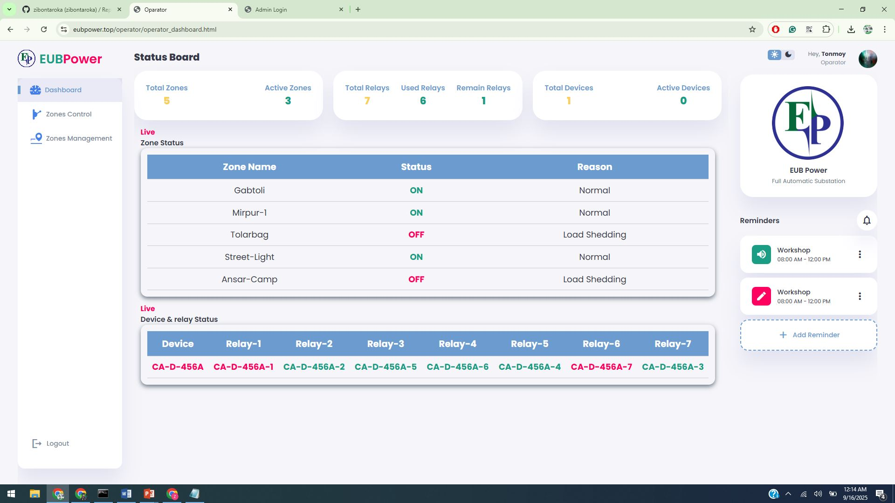
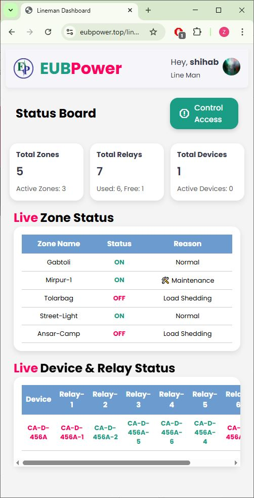
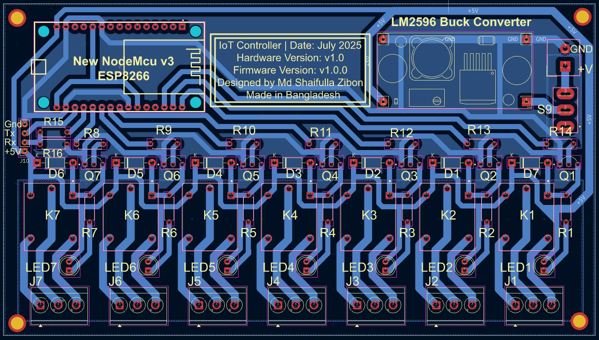

# ⚡ SafeSwitch-IoT: A Secure IoT-Based Control Handover System for Power Line Maintenance

[](https://nodejs.org/)  
[](https://www.postgresql.org/)  
[](https://www.espressif.com/)  
[](LICENSE)  

This repository contains the full implementation of an **IoT-based Smart Power Control Handover System** that enhances **lineman safety** in power distribution networks.  
The system introduces a **formalized handover protocol** where Operators can delegate control of electrical zones/feeders to Linemen, ensuring safe maintenance by preventing accidental re-energization.

---

## 📑 Table of Contents
- [Overview](#-overview)
- [Key Features](#-key-features)
- [Technology Stack](#️-technology-stack)
- [Hardware and PCB Design](#-hardware-and-pcb-design)
- [File Structure](#-file-structure)
- [Getting Started](#-getting-started)
- [Usage](#-usage)
- [Contributing](#-contributing)
- [License](#-license)
- [Contact](#-contact)

---

## 📖 Overview
Power line maintenance is inherently dangerous, particularly in developing regions such as **Bangladesh**, where standardized safeguards are limited.  
One major risk arises when Operators unintentionally re-energize lines under maintenance, causing **severe injury or fatality** for Linemen.  

✅ Our proposed solution:  
A **secure IoT-based control handover system** that ensures Operators **cannot switch relays** in a zone once it is handed over to a Lineman.  
Control is restored only after the Lineman safely revokes access via a **PIN-authenticated interface**.

---

## ✨ Key Features
- 🔐 **Secure Control Handover** – Operator-to-Lineman delegation with mutual exclusion.  
- 👤 **Role-Based Access Control (RBAC)** – Enforces permissions per role.  
- ⚡ **Real-Time Communication** – WebSocket-based low-latency updates.  
- 🔑 **PIN-Based Authentication** – Prevents unauthorized relay operations.  
- 📝 **Auditability & Traceability** – Logs every critical action with user ID, timestamp, feeder/zone.  
- 📈 **Modular & Scalable** – Easily extendable for more devices/zones.  

---

## ⚙️ Technology Stack
**Backend:** Node.js · Express.js · PostgreSQL · WebSocket  
**Frontend:** HTML · CSS · JavaScript  
**Hardware:** ESP8266 · LM2596 Buck Converter · 2N2222 NPN Transistor · 1N4007 Diode · Relays  

---

## 🖥️ Web Application Interface

### Operator Dashboard
Centralized control center for system operators to monitor and manage power distribution network.



**Key Functionalities:**
- 📊 **Real-time Monitoring** - Live status of all feeders and zones
- 🔄 **Control Handover** - Safe delegation to linemen for maintenance
- 🚨 **Emergency Override** - Critical situation management
- 📈 **System Analytics** - Performance metrics and usage statistics
- 👥 **User Management** - Lineman assignment and role management

**Interface Components:**
1. **Sidebar Navigation** - Quick access to different sections
2. **Dashboard Overview** - System-wide status at a glance  
3. **Feeder Control Panel** - Individual zone management
4. **Handover History** - Audit trail of all control transfers
5. **Alert System** - Real-time notifications and warnings

### Lineman Dashboard
Secure, PIN-protected interface for field technicians during maintenance operations.



**Key Functionalities:**
- 🔐 **PIN Authentication** - Secure access to assigned zones
- ⚡ **Relay Control** - Direct control over circuit breakers
- 📱 **Mobile-Friendly** - Optimized for field use
- 🔄 **Status Sync** - Real-time synchronization with backend
- ✅ **Safety Lock** - Prevents accidental operations

**Security Features:**
- Session timeout after inactivity
- PIN-based re-authentication required
- Control limited to assigned zones only
- Audit log of all operations
- Emergency stop functionality

### Workflow Demonstration
**Control Handover Process:**
1. Operator initiates handover from their dashboard
2. Lineman receives notification and enters PIN
3. Control transfers to lineman (operator access locked)
4. Lineman performs maintenance operations
5. Lineman revokes control after completion
6. Operator regains full control automatically

---

## 🔧 Hardware and PCB Design

The **ESP8266 control module** manages up to **7 relays** for breaker/switch control.  
It authenticates with the backend and executes Operator/Lineman commands securely.  

### Relay Control Module
- Authentication with backend  
- Relay switching via GPIO  
- Real-time state reporting  

**Schematic Diagram:**  
  

**PCB Layout:**  
  

🔗 KiCad project & Gerber files are in the [`PCB_design/`](./PCB_design/) directory.  

---


## 📂 File Structure
```

smart-power-handover-system/
├── database/        # PostgreSQL backup (powergrid\_backup.sql)
├── firmware/        # ESP8266 Arduino firmware
├── PCB\_design/      # Hardware design (KiCad + Gerber)
├── photos/          # PCB & schematic images
├── web\_app/         # Web application (frontend + backend)
├── admin/       # Admin dashboard & user management
├── operator/    # Operator control dashboard
├── lineman/     # Lineman PIN-secured dashboard
├── viewer/      # Viewer-only monitoring UI
├── backend/     # Node.js backend (Express + WebSocket)
├── css/         # Stylesheets
├── js/          # Frontend JS logic
└── images/      # UI assets/icons

```

---

## 🚀 Getting Started

### Prerequisites
- [Node.js](https://nodejs.org/) (>= 18.x)  
- [PostgreSQL](https://www.postgresql.org/)  

### Installation

1. **Clone the repository:**
   ```bash
   git clone https://github.com/zibontaroka/SafeSwitch-IoT.git
   cd smart-power-handover-system/web_app/backend
   ```

2. **Install dependencies:**
   ```bash
   npm install
   ```

3. **Set up the database:**
   - Create a PostgreSQL database
   - Import the backup:
     ```bash
     psql -U your_user -d your_db -f ../../database/powergrid_backup.sql
     ```

4. **Configure environment variables:**
   Create `.env` file in `web_app/backend/` directory with:
   ```env
   DB_USER=your_db_user
   DB_HOST=your_db_host
   DB_DATABASE=your_db_name
   DB_PASSWORD=your_db_password
   DB_PORT=your_db_port
   JWT_SECRET=your_jwt_secret
   ```

5. **Start the server:**
   ```bash
   npm start
   ```

---

## 📖 Usage (Control Workflow)

1. **Initiation** → Operator selects feeder/zone & assigns to a Lineman.
2. **Delegation** → Zone marked as `control_active = TRUE`, blocking Operator actions.
3. **Execution** → Lineman controls relays via PIN-authenticated dashboard.
4. **Revocation** → Lineman revokes control (PIN entry → `control_active = FALSE`).
5. **Restoration** → Operator regains full control.

---

## 🤝 Contributing

Contributions, feature requests, and bug reports are welcome!
Please open an **issue** or submit a **pull request**.

---

## 📄 License

This project currently has **no license**.
(You may add `MIT`, `Apache-2.0`, or another license in a [LICENSE](LICENSE) file.)

---

## 📞 Contact

📧 Md Shaifulla Zibon
🔗 [LinkedIn](https://www.linkedin.com/in/md-shaifulla-zibon/)


---


"# SafeSwitch-IoT" 
